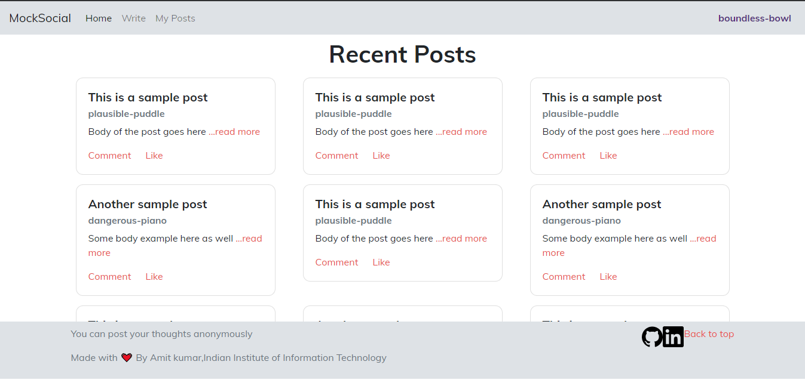
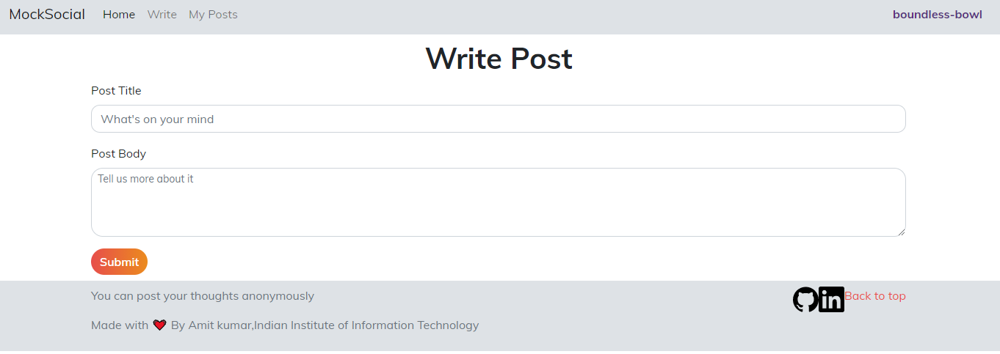
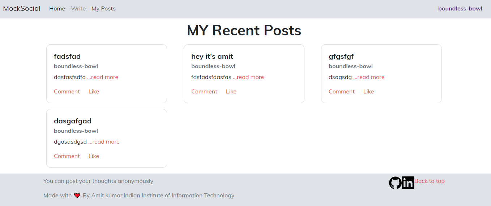
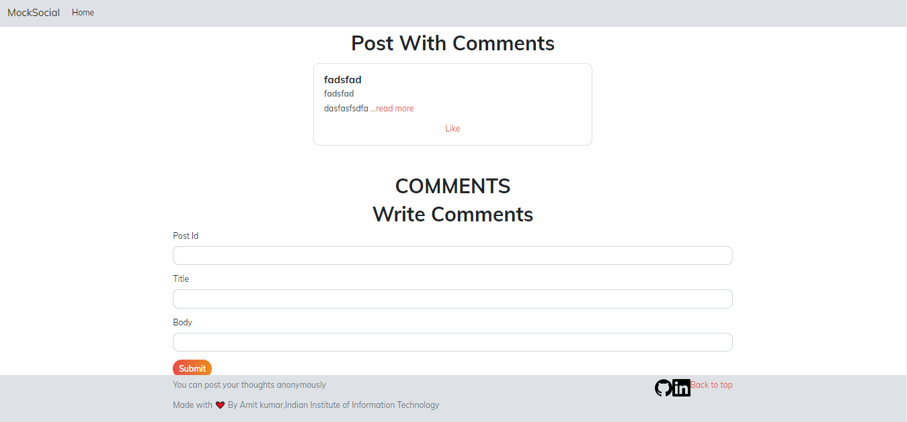

# Social Media Project

You can post your thoughts anonymously. With the functionalities like add post, add comments, view your posts, and many more.


## Screenshots and Gifs
 
 
 
 
 

## Steps to run

- Clone or download this repository
- Go to the project root directory and open terminal/cmd
- Install `npm init` , `npm i sequelize mysql2 express`
- In package.json do
            "scripts": {
                     "start": "node server.js"
                        },

- In terminal go to server.js directory and run node server.js. 
- You are good to go :)


## Database Setup

```shell
$ mysql -u root
```

```mysql
create database cbsocialmediadb;

create user cbsocialuser identified with mysql_native_password by 'cbsocialpass';

grant all privileges on cbsocialmediadb.*  to cbsocialuser;

flush privileges;
```

## Project Structure

### Backend (Server)
```shell
src
├── controllers         # functions to connect routes to db operations
├── db                  # db connection and model definitions
├── public              # html/js/css files for static part of site
└── routes              # express middlewares (route wise)
```

### Frontend (Client Side Code)

```shell
src/public
├── app                                     # our own frontend js code
│   └── common.js
├── components                              # own own html snippets
│   └── navbar.html
├── css                                     # css libraries we are using
│   └── bootstrap.css
├── fonts                                   # fonts that we are using
│   ├── Muli-Italic.woff2
│   ├── Muli.woff2
│   └── muli.css
├── index.html                              # first / home page
└── js                                      # js libraries we are using
    ├── bootstrap.js
    ├── jquery-3.4.1.js
    └── popper.js

```
## Business Logic 

### Users

1. **create users** 
    this will create a new user with a random username

### Posts

1. **create post**
    this will create a new post, required fields are 
    - username (the author of this post)
    - title
    - body 

2. **show all posts**
    list all existing posts, we should have following filtering support

    - filter by username
    - filter by query contained in title (search by title)

3. **edit posts** `TBD`

4. **delete posts** `TBD` 

### Comments 

1. **show all comments (of a user)**

2. **show all comments (under a post)**

3. **add a comment**


## API Documentation 

### `users` 

1. `POST /users` 

Creates a new user with random username and an user id

2. `GET /users/{userid}`

Get an user with a given user id

3. `GET /users/{username}`

Get an user with a given username


### `posts` 

1. `GET /posts` 

Get all posts by everyone 

2. `POST /posts` 

Create a new post. 
Required fields in body - 

```
userId=
title=
body=
```

## To Do

- [ ] Implement the logic to edit posts and delete posts.
- [ ] Implement functionalities like Readmore , Like posts.
- [ ] Style part : Apply basic styling to make the Website look good

##Contributers

**To add more ideas create an issue and a PR with this README updated with your idea**
